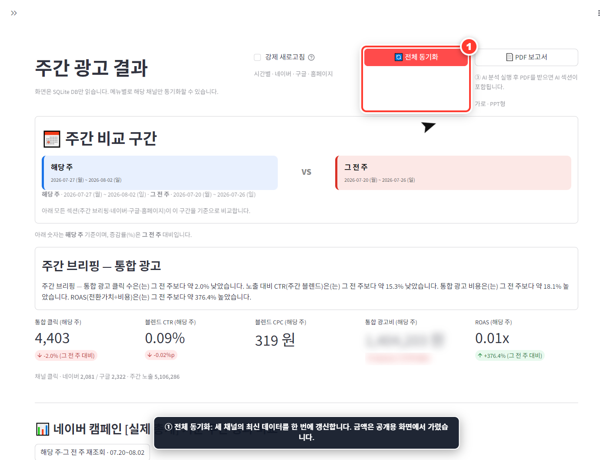
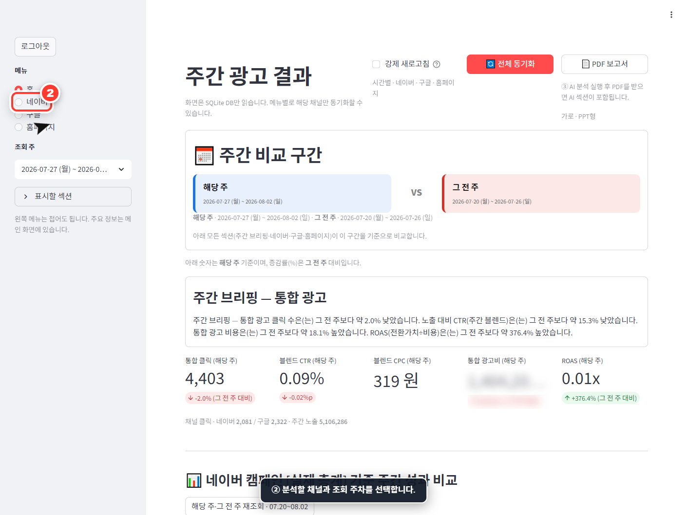
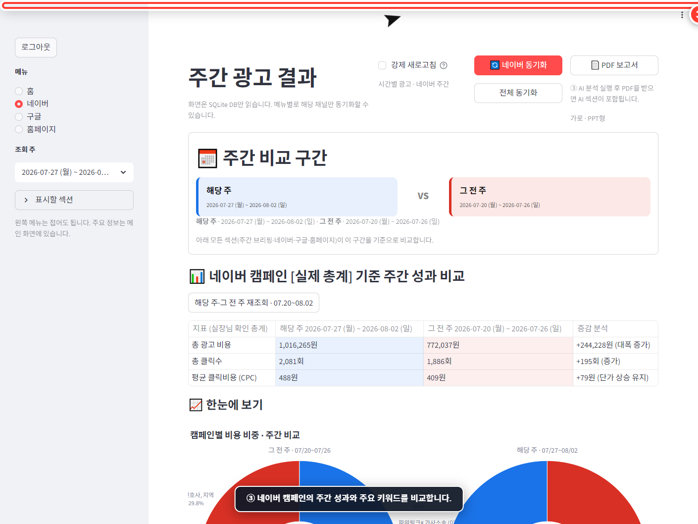
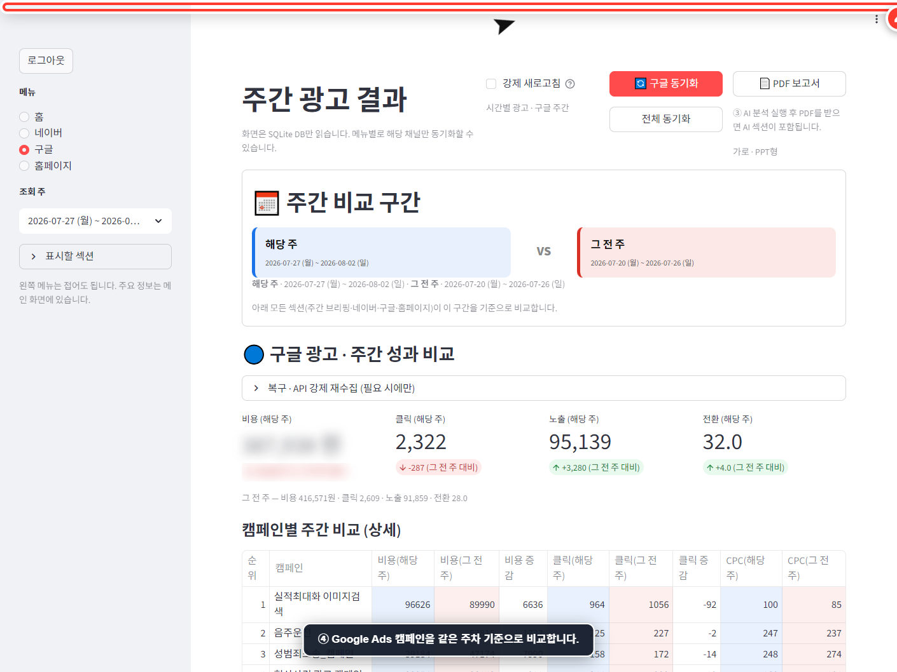
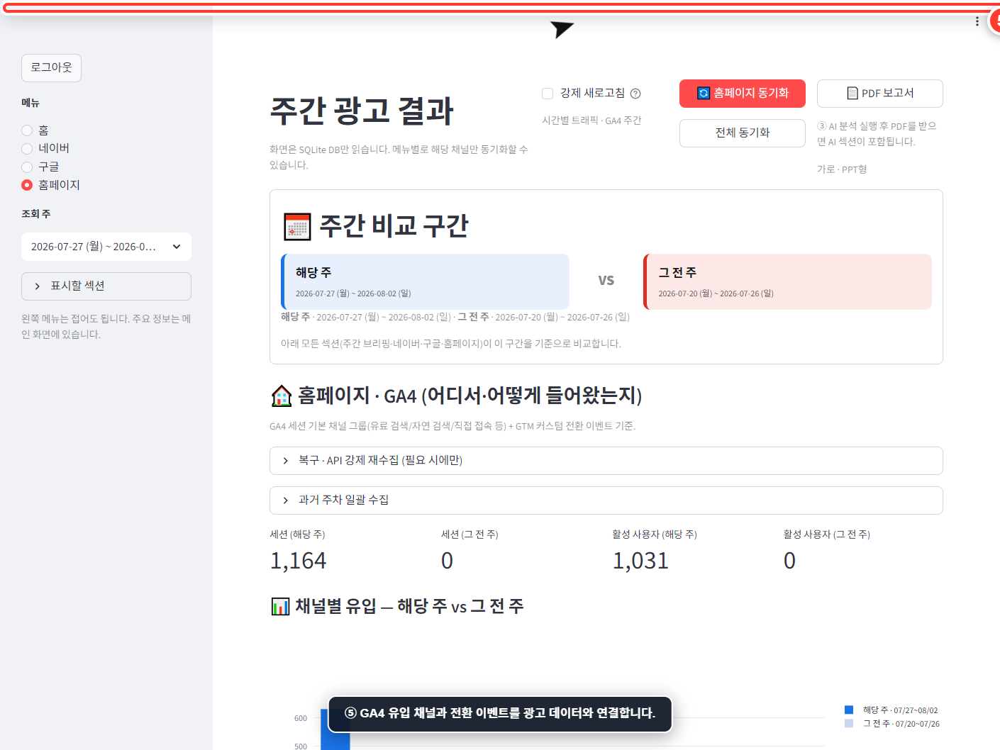

# 주간 광고·GA4 통합 대시보드

## 한 줄 소개

네이버 검색광고, Google Ads, GA4 데이터를 한곳에 모아 광고 성과부터 실제 웹사이트 유입과 전환까지 주간 단위로 비교하는 마케팅 통합 대시보드입니다.

## 프로젝트 소개

광고 채널마다 관리 화면과 지표 체계가 달라 매주 성과를 정리하는 데 많은 시간이 필요했습니다. 이 프로젝트는 여러 채널의 데이터를 자동으로 수집해 같은 주차 기준으로 정리하고, 지난주와 그 전 주의 변화를 한 화면에서 비교할 수 있도록 만든 대시보드입니다.

단순히 광고 노출과 클릭만 보여주는 것이 아니라 광고비, 클릭, CTR, 방문 세션, 유입 채널, 전환 이벤트를 함께 연결합니다. 따라서 “광고를 얼마나 집행했는가”뿐 아니라 “그 결과 실제 방문과 행동이 얼마나 발생했는가”까지 확인할 수 있습니다.

## 핵심 기능

### 1. 여러 채널의 성과를 한 화면에서 통합

네이버 검색광고, Google Ads, GA4 데이터를 하나의 SQLite 데이터베이스에 저장하고 주간 기준으로 통합합니다. 채널별 관리 화면을 번갈아 열지 않아도 광고비와 클릭, 방문 및 전환 흐름을 한 번에 파악할 수 있습니다.

### 2. 해당 주와 그 전 주 자동 비교

완료된 월요일~일요일 구간을 기준으로 두 주의 성과를 비교합니다. 핵심 KPI, 증감률, 캠페인별 성과표와 추이 차트를 함께 제공해 개선과 악화 여부를 빠르게 찾을 수 있습니다.

### 3. 채널별 선택 동기화

전체 데이터를 한 번에 갱신하거나 네이버, Google Ads, 홈페이지 GA4만 따로 동기화할 수 있습니다. 이미 저장된 과거 데이터는 재사용하고 필요한 구간만 증분 수집해 불필요한 API 호출과 대기 시간을 줄였습니다.

### 4. 캠페인과 키워드 상세 분석

네이버 및 Google Ads의 캠페인별 지출, 클릭, CTR을 비교하고 주요 키워드 성과를 확인할 수 있습니다. 평균이나 중앙값과 비교해 효율이 높거나 낮은 캠페인 후보도 자동으로 정리합니다.

### 5. 광고 성과와 GA4 행동 데이터 연결

GA4의 유입 채널, 세션 및 주요 전환 이벤트를 광고 데이터와 함께 보여줍니다. 광고 클릭 이후 실제 사이트 방문과 행동이 발생했는지 확인할 수 있어 매체 지표에만 머무르지 않는 분석이 가능합니다.

### 6. AI 분석과 보고서 내보내기

Gemini를 이용해 주간 성과를 문장으로 분석하고 후속 질문을 이어갈 수 있습니다. 선택한 주의 결과와 AI 분석 내용을 가로형 PDF 보고서로 내려받아 정기 보고 자료로 활용할 수 있으며, 캠페인 비교표는 CSV로도 저장할 수 있습니다.

### 7. 이상 징후와 수집 이력 관리

급격한 지표 변화 등 이상 징후를 기록하고 최근 데이터 수집 이력을 확인할 수 있습니다. 화면은 저장된 데이터베이스만 읽도록 분리해 과거 화면을 열 때마다 외부 API를 다시 호출하지 않습니다.

## 이 프로젝트가 특별한 이유

- 광고 플랫폼과 웹 분석 데이터를 동일한 주차 기준으로 결합했습니다.
- 화면 조회와 외부 API 수집을 분리해 속도와 안정성을 높였습니다.
- 저장된 데이터는 재사용하고 누락된 기간만 수집하는 증분 동기화를 적용했습니다.
- 채널별 요약, 캠페인·키워드 상세, GA4 전환, AI 해설, PDF 보고서를 하나의 흐름으로 연결했습니다.
- 실행 스크립트와 스케줄러를 포함해 반복적인 주간 보고 업무를 자동화할 수 있습니다.

## 사용 방법

### 1단계 — 전체 데이터 갱신

대시보드 상단의 `전체 동기화` 버튼을 누르면 네이버, Google Ads, 홈페이지 데이터를 최신 상태로 갱신합니다. 특정 채널만 확인할 때는 해당 화면의 채널별 동기화 버튼을 사용합니다.

### 2단계 — 분석할 채널과 주차 선택

왼쪽 사이드바에서 홈, 네이버, 구글, 홈페이지 중 하나를 선택합니다. 바로 아래에서 조회할 주차를 선택할 수 있으며, 필요한 보고서 섹션만 골라 표시할 수도 있습니다.

### 3단계 — 네이버 검색광고 분석

네이버 화면에서는 선택 주와 이전 주의 캠페인 성과를 비교합니다. 광고비, 클릭, CTR, 캠페인별 비교와 주요 키워드 데이터를 확인하고 필요한 경우 네이버 데이터만 다시 동기화합니다.

### 4단계 — Google Ads 성과 비교

구글 화면에서 캠페인별 주간 성과와 변화를 확인합니다. 네이버와 같은 주차 기준으로 데이터를 정리하므로 채널 간 성과 비교가 쉬우며 결과표는 CSV로 내려받을 수 있습니다.

### 5단계 — GA4 유입과 전환 확인

홈페이지 화면에서는 GA4 유입 채널과 주요 전환 이벤트를 확인합니다. 광고비 및 클릭 지표와 실제 사이트 세션을 함께 비교해 광고가 방문과 행동으로 이어졌는지 판단합니다.

### 6단계 — AI 분석 및 PDF 보고서 저장

AI 주간 분석을 실행하면 주요 변화와 개선 포인트가 문장으로 정리됩니다. 분석을 완료한 후 상단의 `PDF 보고서` 버튼을 누르면 AI 분석이 포함된 주간 보고서를 내려받을 수 있습니다.

## 웹사이트 카드용 짧은 소개

**주간 광고·GA4 통합 대시보드**  
네이버 검색광고, Google Ads, GA4 데이터를 자동 수집해 주간 성과와 증감률을 한 화면에서 비교합니다. 캠페인·키워드 분석, 웹사이트 유입 및 전환 확인, Gemini AI 해설, PDF 보고서 생성까지 반복적인 마케팅 보고 과정을 하나로 통합했습니다.

## 대표 문구 후보

- 흩어진 광고 데이터를 하나의 주간 인사이트로
- 광고 클릭에서 웹사이트 전환까지, 한 화면에서 확인하세요
- 매주 반복되던 광고 보고를 자동화한 통합 분석 대시보드
- 네이버·Google Ads·GA4를 연결하는 실전형 마케팅 리포트

## 기술 구성

- UI: Python, Streamlit
- 데이터 처리: pandas
- 시각화: Plotly, Matplotlib
- 저장소: SQLite
- 연동: 네이버 검색광고 API, Google Ads API, Google Analytics Data API
- AI 분석: Gemini API
- 보고서: ReportLab 기반 PDF, CSV 내보내기
- 운영 자동화: 시간별·주간 동기화 스케줄러, Telegram 알림

## 이미지 파일 안내

- `01_home_overview_guided.png`: 전체 동기화 버튼이 강조된 메인 화면
- `01_home_overview_raw.png`: 안내 표시가 없는 메인 화면 원본
- `02_sidebar_navigation_guided.png`: 채널 및 조회 주차 선택 안내
- `03_naver_dashboard_guided.png`: 네이버 검색광고 분석 화면
- `04_google_dashboard_guided.png`: Google Ads 분석 화면
- `05_ga4_dashboard_guided.png`: 홈페이지 GA4 분석 화면

> 게시 전 참고: 캡처 이미지는 실제 로컬 데이터베이스를 사용해 생성되었습니다. 외부 공개 시 광고비·클릭·캠페인명 등 사업상 민감한 데이터가 포함되어 있는지 최종 확인한 뒤 게시하세요.
